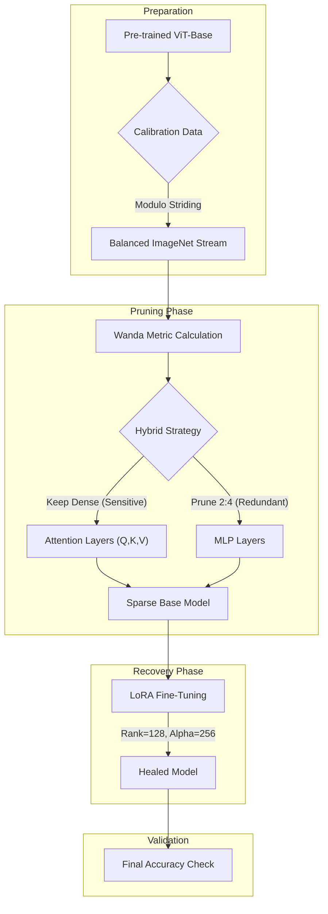

# VisWanda-Eco-VLM: Hardware-Aware 2:4 Pruning for Vision Transformers

> **"Smashing" Vision Models for the Edge.** An implementation of Activation-Aware Pruning (Wanda) tailored for Vision Transformers, combining Hybrid 2:4 Structured Sparsity with LoRA Recovery for efficient edge deployment.

## 📸 Find the Live App here: [pruned-ViT](https://huggingface.co/spaces/Tekraj15/VisWanda-Eco-VLM)

## Motivation
Running huge Vision Language Models(VLMs) on the limited/consumer hardware is what every AI researcher or lab swears by, and I'm no different. Vision Transformers (ViTs) are powerful but computationally expensive, making them difficult to deploy on edge devices or in sustainable "Green AI" pipelines. Standard unstructured pruning (removing random weights) offers theoretical compression but **zero inference speedup** on modern hardware because GPUs cannot skip random zeros efficiently.

**The Solution:** 2:4 Structured Sparsity. By enforcing a pattern where exactly 2 out of every 4 consecutive weights are zero, we can unlock **2x math throughput** on NVIDIA Ampere (A100) and Hopper (H100) Tensor Cores.

## Objective
To adapt the **Wanda (Pruning by Weights and activations)** metric, which is originally designed for LLMs, to the **Vision Domain**, specifically targeting:

1.  **Activation-Awareness:** Preserving weights that connect to high-magnitude image patches (outliers).
2.  **Hardware-Readiness:** Enforcing 2:4 semi-structured sparsity patterns compatible with TensorRT and cuSPARSELt.
3. **Recoverable:** Using Low-Rank Adaptation (LoRA) to heal the accuracy loss caused by pruning.

## Methodology

> **Logical workflow**: Data Stream $\to$ Hybrid Pruning $\to$ LoRA Recovery $\to$ Deployment

This approach differs from standard pruning by treating Attention Layers and MLP Layers differently to maximize performance preservation.

## 1. The Pipeline

Methodology & WorkflowLogical workflow: .Our approach differs from standard pruning by treating Attention Layers and MLP Layers differently to maximize performance preservation.

## 2. The "Wanda" Process (Data Calibration)
To make intelligent pruning decisions, we perform One-Shot Calibration:
1. Modulo Strided Streaming: We stream samples from ImageNet-1k using a modulo stride strategy (picking every $N^{th}$ image) to ensure perfect class diversity without memory overhead.

2. Activation Hooking: We pass these samples through the model to calculate the feature norm $||X||_2$ for every layer.

3. Visual Wanda Score: Unlike magnitude pruning, we calculate importance based on input activations:

$$\text{Score}_{ij} = |W_{ij}| \times ||X_j||_2$$

This ensures we preserve weights that react to high-magnitude visual features (like edges or textures).

## 3. Hybrid 2:4 Structured Pruning
We apply a Hybrid Masking Strategy:

Attention Layers (Q, K, V): Kept Dense. Our experiments showed these layers are hypersensitive in ViTs. Pruning them causes unrecoverable accuracy collapse.

MLP Layers (Intermediate/Output): Pruned with 2:4 Structured Sparsity. We reshape weights into groups of 4 and prune the 2 lowest-scoring weights. This targets the heavy computation blocks where 2x speedup is most valuable.

## 4. Post-Pruning Recovery (LoRA)
Pruning 50% of the MLP weights damages the model's internal representation. We repair this using LoRA (Low-Rank Adaptation):

Target: All Linear Layers (query, key, value, dense).

Configuration: High Rank (r=128) and High Alpha (alpha=256) to provide maximum "healing" capacity.

Data Augmentation: Random crops and flips during fine-tuning force the model to relearn robust features rather than memorizing the sparse mask.

## Validation 
To ensure the pruned model remains functional for real-world tasks, we validate it against the full ImageNet-1k Validation Set (50,000 images). We focus on Top-1 Accuracy, which measures how often the model's highest-probability prediction matches the correct label.

- Dataset: ImageNet-1k Validation Split ($N=50,000$)
- Primary Metric: Top-1 Accuracy Drop
- Success Criteria: An accuracy drop of $< 1\%$ compared to the dense baseline.

The performance gap is calculated as:
> Accuracy_drop = {Accuracy of Dense ViT Model} - {Accuracy of Pruned+LoRA ViT Model}

We categorize the results as follows:
✅ Success: Accuracy_drop < 1.0% (Negligible loss)
⚠️ Warning: Accuracy_drop < 5.0% (Noticeable but usable)
❌ Failure: Accuracy_drop >= 5.0% (Significant degradation)

## Results Summary
We achieved a global sparsity of ~31% (due to the Hybrid Strategy) while maintaining accuracy within a ~2% margin of the dense baseline.

---

## 🛠️ Tech Stack
* **Core Frameworks:** Python, PyTorch
* **Model Libraries:** HuggingFace `transformers` (ViT-Base, ViT-Large), peft (Parameter-Efficient Fine-Tuning)
* **Data Handling:** ImageNet-1k Calibration samples(HF Streaming mode), COCO
* **Acceleration (Future):** NVIDIA TensorRT/Hopper Tensor Cores (Sparse Tensor Support)

---

## 📊 Results Summary

We achieved a global sparsity of **~31%** (due to the Hybrid Strategy) while maintaining accuracy within a **~2%** margin of the dense baseline. It highlights the two main benefits: 
- the storage efficiency of LoRA (easy distribution), and 
- the computational efficiency of the 2:4 sparsity (faster inference on supported hardware).

Here's the results summary for Accuracy, Sparsity, Parameter and Storage footprint:

| Metric                 | Dense Baseline| Pruned (Hybrid 2:4) + LoRA|
|------------------------|---------------|---------------------------|
| **Top-1 Accuracy**     | 82.81%        | 80.47%                    |
| **Accuracy Drop**      | -             | 2.34%                     |
| **Global Sparsity**    | 0%            | 33.03%                    |
| **MLP Block Sparsity** | 0%            | 50.00% (2:4 Structured)   |
| **Parameter Size**     | ~86 Million   | ~55 Million               |
| **Trainable Params**   | 100% (86M)    | ~8.3% (7.8M)              |
| **Distribution Size**  | ~345 MB       | ~30 MB (Adapters only)    |

> **Note:** MLP layers achieve full 50% sparsity (2:4 structured), while Attention layers remain dense to preserve accuracy. This hybrid approach explains the ~33% global sparsity figure.
